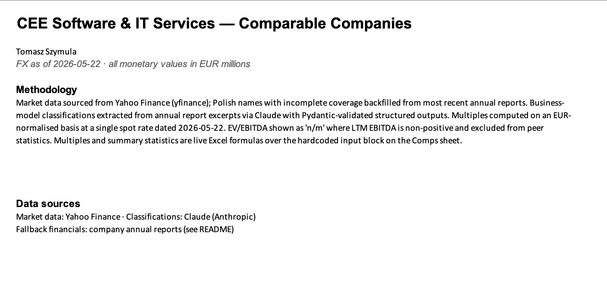
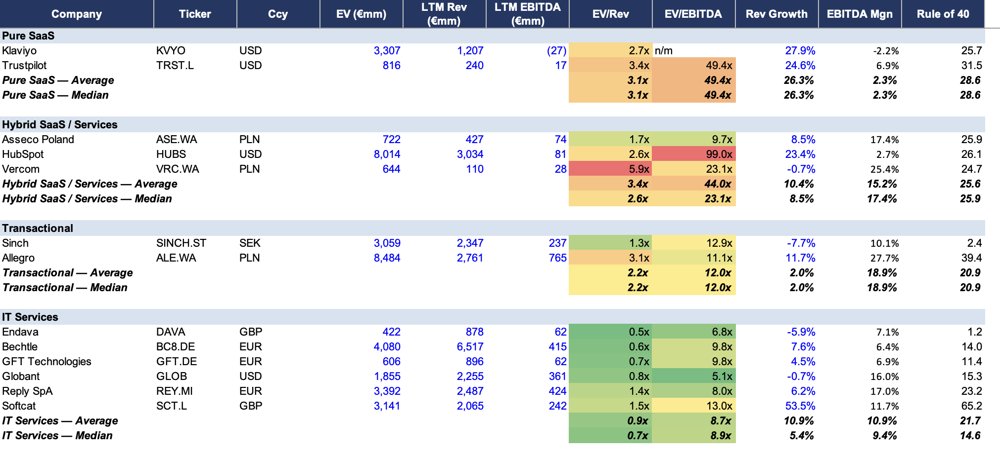
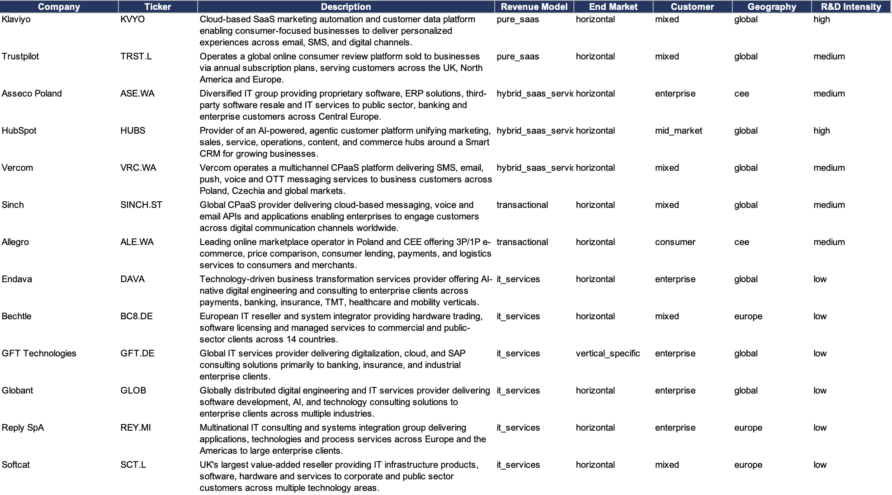
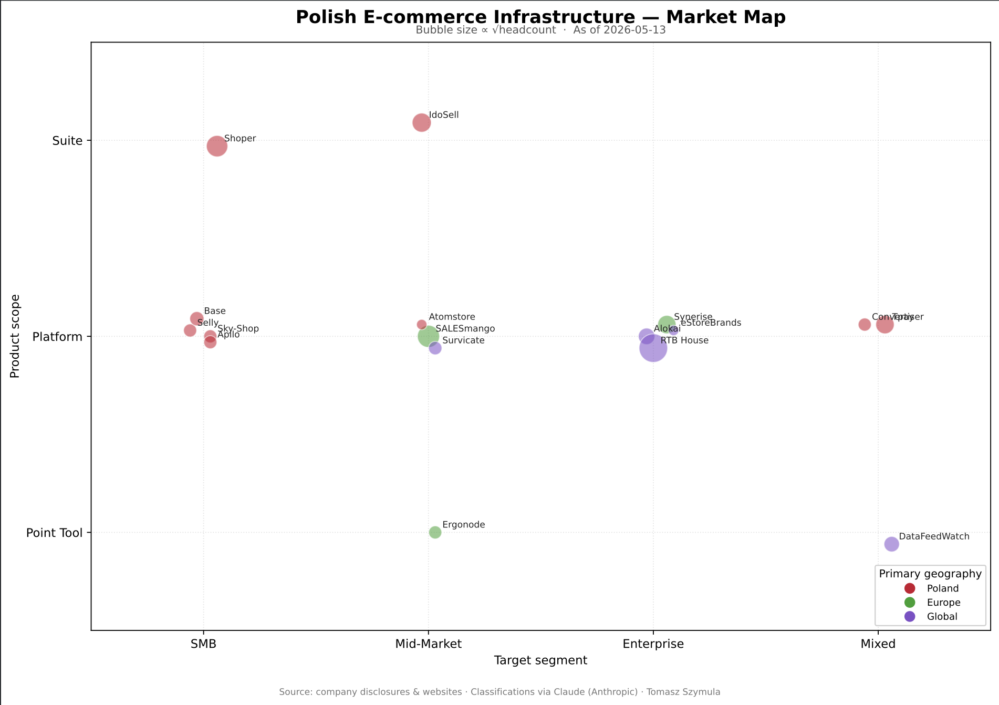

# cee-software-comps

A small toolkit for maintaining a CEE software & IT services comp set,
with LLM-assisted business model classification.

## What it does

Maintains a 15-company comp universe across Polish-listed software,
European IT services, and pure-play SaaS benchmarks. Pulls market data
from yfinance, classifies business models from annual report excerpts
using Claude with structured outputs, computes standard multiples,
and produces an Excel deliverable. Also produces a one-page market map
of Polish e-commerce infrastructure.

## Sample output

<!-- Three screenshots, taken AFTER the manual Excel recalc step. -->

<!-- screenshot: docs/img/cover_sheet.png
     The full Cover sheet of comps_v1.xlsx — title, methodology,
     FX date, data sources. -->


<!-- screenshot: docs/img/comps_sheet.png
     The Comps sheet, ideally cropped to show one full revenue-model
     group with its mean/median rows. Conditional formatting on
     EV/Rev and EV/EBITDA columns should be visible. -->


<!-- screenshot: docs/img/profiles_sheet.png
     The Profiles sheet — one-line analyst-style descriptions plus
     the full classification fields (revenue model, end market,
     customer profile, geography, R&D intensity). This is where the
     LLM-classification work is most visible. -->


<!-- screenshot: docs/img/market_map.png
     Either the full ecom_map_v1.pdf rendered as PNG, or the
     cleaned-up version if you've done label cleanup in a vector
     editor. -->


## Architecture

Four stages, each runnable independently; each persists to DuckDB so
later stages read from the table rather than recomputing:

1. **Ingest** — `cli fetch`. Market data via yfinance → `market_data`.
2. **Extract** — `cli classify`. Annual report excerpts → structured
   profiles via Claude tool use with Pydantic schemas. Cached by
   content hash so re-runs are free.
3. **Enrich** — run inside `cli build`. FX-normalisation, multiples,
   peer statistics → `enriched_comps`.
4. **Output** — `cli build`. Excel via openpyxl, PDF map via matplotlib.

## Design choices

- **Pydantic schemas for LLM outputs.** Validation, not regex parsing.
- **DuckDB for persistence.** In-process, queryable, parquet-native.
- **Content-hash caching.** LLM calls are slow and cost money; the
  cache is committed to the repo, so the pipeline reproduces without
  any API key (see "Run with cached data" below).
- **No framework dependencies (no LangChain, no LlamaIndex).** Direct
  Anthropic SDK keeps the code legible.
- **Excel multiples are live formulas, not pasted values.** The EUR
  input block is hardcoded (blue, per banking convention); every
  multiple and peer statistic is an Excel formula over it, so the
  sheet recomputes if an input changes. EV/EBITDA is IFERROR-guarded
  to "n/m" for non-positive EBITDA and excluded from peer means.

## In scope for v1

- 13-company comp universe across Polish-listed software, European
  IT services, and pure-play SaaS benchmarks (15 named, 2 excluded
  pending manual fallback values for thin yfinance coverage)
- yfinance market data with manual annual-report fallback hook for
  thin-coverage Polish names
- Claude business-model classification (revenue model, end market,
  customer profile, geography, R&D intensity)
- EUR-normalised trading multiples: EV/Revenue, EV/EBITDA, EBITDA
  margin, revenue growth, Rule of 40
- Three-sheet Excel deliverable (Cover, Comps, Profiles) with live
  formulas and per-bucket summary statistics
- One-page market map of Polish e-commerce infrastructure (17 names)

## Out of scope (planned extensions)

- **Manual fallback for thin-coverage Polish names.** Comarch (CMR.WA)
  and LiveChat/Text (LVC.WA) excluded from v1 due to incomplete
  yfinance fundamentals; the `YFINANCE_FALLBACKS` hook in config
  supports manual backfill from annual reports.
- **Migration to Anthropic structured outputs (`output_config`).**
  Forced tool use works in v1; native structured outputs would
  eliminate residual Literal-mismatch risk via grammar-constrained
  decoding.
- **Scraping Polish company financials from Bankier.pl or WSE ESPI**
  to remove the manual annual-report step for thin-coverage names.
- KRS filing parsing for Polish private company financials.
- One-page tear sheet generation per comp.
- Nightly refresh and diff alerts.
- Expansion to ~30 names including UK/Nordic AIM-listed software and
  private CEE PE-backed names beyond Poland.

## Run it

Requires Python 3.13+, `uv`, and an Anthropic API key in `.env`.

```bash
uv sync
echo 'ANTHROPIC_API_KEY=sk-ant-...' > .env

cee-comps fetch
cee-comps classify --target comps
cee-comps classify --target map
cee-comps build
# Open data/output/comps_v1.xlsx once in Excel or LibreOffice and
# save — this populates the live formula values (openpyxl writes
# formulas, not cached results).
```

## Run with cached data

LLM classifications are committed to `data/llm_cache/`, so the
pipeline reproduces without an Anthropic API key. From a fresh clone:

```bash
uv sync
cee-comps fetch     # market data via yfinance (no key needed)
cee-comps build     # reads cached classifications, generates outputs
# Open data/output/comps_v1.xlsx once in Excel or LibreOffice and save.
```

## Cost note

<!-- After your final cold run, replace with actual measured numbers.
     Find spend at console.anthropic.com → Usage → today's filter.
     Find timing in the elapsed-time output of each cli classify
     run (printed by rich.progress). Format suggestion:
     "$0.XX total spend; XmYYs cold; <5s warm cache" -->

A full refresh costs roughly $2.81 in Claude API usage and runs in
under 2 minutes cold-cache, near-instant on warm cache.